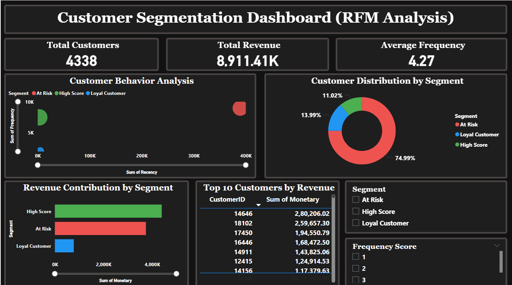

# 👥 Customer Segmentation using RFM Analysis

## 📌 Project Overview
This project segments customers using **RFM (Recency, Frequency, Monetary)** analysis
on real retail transaction data and visualizes insights through a Power BI dashboard.

## 🛠️ Tools Used

## 📊 Key Metrics

| Metric | Value |
|--------|-------|
| 👥 Total Customers Analyzed | 4,338 |
| 💰 Total Revenue | £8,911,407.90 |
| 📅 Avg Recency | 91.54 days |
| 🛒 Avg Order Frequency | 4.27 orders |
| 💵 Avg Customer Value | £2,054.27 |

## 🎯 Customer Segments

| Segment | Count | Revenue |
|---------|-------|---------|
| 🔴 At Risk | 3,253 | £37,41,639 |
| 🟡 Loyal Customer | 607 | £7,76,527 |
| 🟢 High Score | 478 | £43,93,242 |

## 💡 Business Findings
- **High Score customers (478 only)** generate the **highest revenue — £43,93,242**
  despite being the smallest group
- **75% customers are At Risk** — urgent need for re-engagement campaigns
- **Loyal customers** purchase **4.27 times on average** — strong retention base
- Top 11% customers (High Score) contribute **~49% of total revenue**
- Businesses should focus on converting **Loyal → High Score** customers

## 📸 Dashboard Preview

## 🚀 How to Run
1. Clone this repository
2. Place `OnlineRetail.csv` in the project folder
3. Run `OnlineRetail_code.py`
4. Open `Customer_Retail.pbix` in Power BI

## 📌 Author
**Kanika Chauhan** — Aspiring Data Analyst
